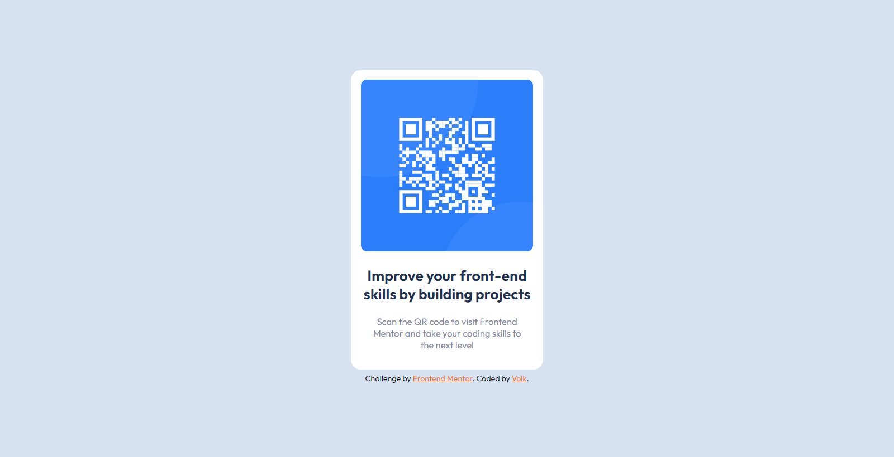

# Frontend Mentor - QR code component solution

This is a solution to the [QR code component challenge on Frontend Mentor](https://www.frontendmentor.io/challenges/qr-code-component-iux_sIO_H). Frontend Mentor challenges help you improve your coding skills by building realistic projects. 

## Table of contents

- [Frontend Mentor - QR code component solution](#frontend-mentor---qr-code-component-solution)
  - [Table of contents](#table-of-contents)
  - [Overview](#overview)
    - [Screenshot](#screenshot)
    - [Links](#links)
  - [My process](#my-process)
    - [Built with](#built-with)
    - [What I learned](#what-i-learned)
    - [Useful resources](#useful-resources)
  - [Author](#author)

**Note: Delete this note and update the table of contents based on what sections you keep.**

## Overview

### Screenshot



### Links

- Solution URL: [Solution](https://github.com/volkgames/Frontend-Mentor-Qr-code)
- Live Site URL: [Live Preview](volkgames.github.io/Frontend-Mentor-Qr-code.github.io)

## My process

### Built with

- CSS custom properties
- Flexbox

### What I learned

Use this section to recap over some of your major learnings while working through this project. Writing these out and providing code samples of areas you want to highlight is a great way to reinforce your own knowledge.

To see how you can add code snippets, see below:

```html
<h2>Good Practice</h2>
```
```css
@import url(Font Family Url)
```

### Useful resources

- [Google Fonts](https://fonts.google.com/) - This helped me for font of my website. I really liked this web and will use it going forward.


## Author

- Github - [Volk](https://github.com/volkgames)
- Frontend Mentor - [@volk](https://www.frontendmentor.io/profile/volkgames)
- Facebook - [volk3dvisuals](https://www.facebook.com/volk3dvisuals)
